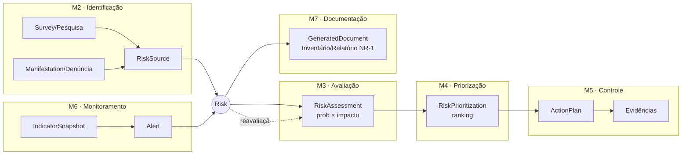

# Diagrama ER — Plataforma NR-1

Modelo de dados completo (8 módulos + Hub + Escuta Ativa + LGPD + IA).
Renderiza no GitHub, VS Code (Markdown Preview Mermaid) ou em https://mermaid.live.

## Visão macro — o ciclo de vida do Risco (Módulos 2→7)

A entidade `Risk` percorre as 6 fases da NR-1. Este recorte mostra a espinha dorsal:

## Diagrama ER completo

```mermaid
erDiagram
    %% ===== NÚCLEO =====
    Organization ||--o{ Department : tem
    Organization ||--o{ Membership : tem
    Organization ||--o| RiskMatrixConfig : configura
    Department ||--o{ Department : hierarquia
    Department ||--o{ Membership : aloca
    User ||--o{ Membership : participa
    Department ||--o{ Risk : localiza

    %% ===== MÓDULO 1 · SOCIOEMOCIONAL =====
    Organization ||--o{ LearningTrack : oferece
    LearningTrack ||--o{ LearningContent : agrupa
    LearningContent ||--o{ ContentProgress : registra
    User ||--o{ ContentProgress : progride

    %% ===== MÓDULO 2 · IDENTIFICAÇÃO =====
    Organization ||--o{ Survey : aplica
    Survey ||--o{ SurveyVersion : versiona
    Survey ||--o| SurveyVersion : vigente
    SurveyVersion ||--o{ SurveyQuestion : contém
    SurveyVersion ||--o{ SurveyResponse : recebe
    Survey ||--o{ SurveyResponse : agrega
    SurveyQuestion ||--o{ SurveyAnswer : responde
    SurveyResponse ||--o{ SurveyAnswer : compõe
    User ||--o{ SurveyResponse : responde
    RiskCategory ||--o{ SurveyQuestion : mapeia
    RiskCategory ||--o{ Risk : classifica

    %% ===== RISCO (núcleo M2→M7) =====
    Organization ||--o{ Risk : possui
    Risk ||--o{ RiskAssessment : avalia
    Risk ||--o| RiskPrioritization : prioriza
    Risk ||--o{ ActionPlan : trata
    Risk ||--o{ RiskSource : fundamenta
    Risk ||--o{ AiInsight : analisa
    SurveyResponse ||--o{ RiskSource : origina
    Manifestation ||--o{ RiskSource : origina

    %% ===== MÓDULO 5 · CONTROLE =====
    Organization ||--o{ ActionPlan : gerencia
    ActionPlan ||--o{ ActionEvidence : comprova
    ActionPlan ||--o{ ActionComment : comenta
    User ||--o{ ActionPlan : responsavel
    User ||--o{ ActionEvidence : envia

    %% ===== MÓDULO 6 · MONITORAMENTO =====
    Organization ||--o{ IndicatorSnapshot : mede
    Organization ||--o{ Alert : emite

    %% ===== MÓDULO 7 · DOCUMENTAÇÃO =====
    Organization ||--o{ GeneratedDocument : gera
    Organization ||--o{ AuditLog : audita
    User ||--o{ AuditLog : autor

    %% ===== ESCUTA ATIVA =====
    Organization ||--o{ Manifestation : recebe
    User ||--o{ Manifestation : autor
    User ||--o{ Manifestation : trata

    %% ===== HUB DE CONVIVÊNCIA =====
    Organization ||--o{ FeedPost : publica
    User ||--o{ FeedPost : posta
    Organization ||--o{ Campaign : promove
    Campaign ||--o{ Notification : dispara

    %% ===== LGPD =====
    User ||--o{ Consent : consente
    ConsentPolicy ||--o{ Consent : rege
    User ||--o{ DataSubjectRequest : solicita

    %% ===== MÓDULO 8 · IA E AUTOMAÇÕES =====
    Organization ||--o{ Integration : conecta
    Organization ||--o{ SystemEvent : publica
    Organization ||--o{ AutomationFlow : orquestra
    Organization ||--o{ WebhookEndpoint : assina
    AutomationFlow ||--o{ AutomationAction : executa
    AutomationFlow ||--o{ AutomationRun : roda
    SystemEvent ||--o{ AutomationRun : dispara
    SystemEvent ||--o{ WebhookDelivery : notifica
    WebhookEndpoint ||--o{ WebhookDelivery : entrega
    Organization ||--o{ AiAgent : provê
    AiAgent ||--o{ AiConversation : conversa
    AiConversation ||--o{ AiMessage : troca
    Organization ||--o{ AiInsight : recebe
    AiAgent ||--o{ AiInsight : produz
    Organization ||--o{ ExecutiveSummary : resume
    AiAgent ||--o{ ExecutiveSummary : escreve
```

## Legenda de cardinalidade (crow's foot)

| Notação | Significado |
|---|---|
| `\|\|--o{` | um-para-muitos (1 obrigatório → 0..N) |
| `\|\|--o\|` | um-para-um opcional |

## Perfis de acesso (`Role` em `Membership`)

`SUPER_ADMIN` · `CONSULTANT` · `COMPANY_ADMIN` · `HR` · `LEADER` · `EMPLOYEE` · `AUDITOR`
